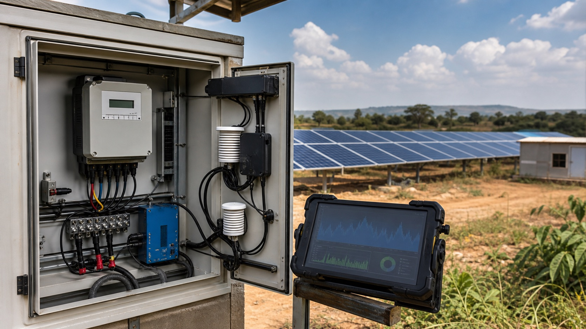

# DMRV가 무엇인가요?

*현장 설비의 계량값이 데이터 수집 장치와 디지털 기록으로 연결되는 DMRV 운영 환경*

기업은 이미 많은 데이터를 만들고 있습니다. 공장의 전력·연료 사용량, 차량의 운행거리와 연료소비량, 태양광 발전량, 폐기물 처리량과 메탄 포집량처럼 온실가스와 연결되는 운영 데이터도 매일 쌓입니다.

하지만 데이터가 존재한다는 사실만으로 탄소 크레딧이 발급되거나 기업의 탄소자산이 되는 것은 아닙니다. 어떤 설비에서 언제 수집된 데이터인지, 어떤 기준선과 방법론을 적용했는지, 계산 과정에서 값이 변경되지는 않았는지, 독립된 검증기관이 같은 결과를 다시 확인할 수 있는지를 설명해야 합니다.

이 과정을 디지털 환경에서 연결하는 체계가 **DMRV(Digital Monitoring, Reporting and Verification)**입니다.

> **DMRV는 현장에서 발생한 데이터를 감축량의 근거로 만들고, 그 근거를 보고·검증·발급 단계까지 추적할 수 있도록 연결하는 디지털 MRV 체계입니다.**

## MRV에 디지털이 더해진 구조입니다

MRV는 모니터링, 보고와 검증의 약자입니다.

| 구성 | 하는 일 | 태양광 발전사업의 예 |
| --- | --- | --- |
| Monitoring | 방법론에서 요구하는 활동·설비 데이터를 지속적으로 수집하고 품질을 관리합니다. | 전력계량기의 발전량, 설비 가동시간과 고장시간을 기록합니다. |
| Reporting | 적용한 방법론, 기준선, 계산식과 감축량을 근거자료와 함께 정리합니다. | 화석연료 전력을 대체한 발전량과 배출계수를 이용해 감축량을 산정합니다. |
| Verification | 독립 검증기관이 데이터, 계산과 절차가 기준에 맞는지 확인합니다. | 계량기 기록, 교정 이력과 계산 결과를 원천자료와 대조합니다. |
| Digital | 세 단계를 센서, API, 데이터베이스와 소프트웨어로 연결합니다. | 계량기 원천값부터 보고서의 최종 감축량까지 변경 이력을 추적합니다. |

일부 자료에서는 MRV의 M을 Measurement라고 표현하기도 하지만, 탄소사업과 제도에서는 일정 기간의 활동과 성과를 지속적으로 관리한다는 의미에서 **Monitoring**이 널리 사용됩니다.

세계은행은 MRV를 특정 감축활동의 온실가스 감축량을 모니터링하고, 결과를 독립된 제3자에게 보고하며, 검증된 성과를 인증해 탄소 크레딧 발급으로 연결하는 다단계 과정으로 설명합니다. DMRV는 이 과정에서 수작업 기록과 문서 전달을 줄이고 데이터 수집, 처리와 품질관리를 디지털화합니다. [World Bank, Carbon Markets: Why Digitization Will Be Key to Success](https://blogs.worldbank.org/en/climatechange/carbon-markets-why-digitization-will-be-key-success)

## 기존 MRV와 무엇이 다른가요?

전통적인 MRV에서는 현장 담당자가 계량기 값을 종이에 적거나 엑셀 파일에 옮기고, 여러 부서가 이메일로 증빙을 주고받는 경우가 많았습니다. 검증 시점이 되면 담당자가 흩어진 사진, 영수증과 장비 기록을 다시 모아야 했습니다.

DMRV는 단순히 종이 보고서를 PDF로 바꾸는 것이 아닙니다.

- 센서, 계량기, 위성, 차량 단말기와 기업 시스템에서 데이터를 직접 수집합니다.
- 시간, 위치, 설비와 데이터 생성자를 원천값에 연결합니다.
- 누락, 중복, 비정상값과 장비 교정기간을 자동으로 확인합니다.
- 방법론의 계산식과 배출계수를 버전별로 관리합니다.
- 원천 데이터가 보고서의 어떤 숫자에 사용됐는지 추적합니다.
- 수정 전후의 값과 승인자를 변경 이력으로 남깁니다.
- 검증기관이 필요한 표본과 증빙에 접근할 수 있도록 합니다.

세계은행의 DMRV 연구는 IoT 센서, 위성영상, 분산원장과 같은 기술이 데이터 수집과 처리, 품질관리를 개선할 수 있다고 설명합니다. 동시에 기술만 도입해서는 충분하지 않으며 방법론, 데이터 표준, 거버넌스와 제도 간 호환성이 함께 필요하다고 강조합니다. [World Bank, Digital Monitoring, Reporting, and Verification Systems](https://documents.worldbank.org/en/publication/documents-reports/documentdetail/099605006272210909)

## 기업 데이터는 어떻게 탄소 크레딧으로 이어지나요?

탄소 크레딧은 일반적으로 이산화탄소환산량 1톤을 추가로 감축하거나 제거한 성과를 나타냅니다. 이 1톤이 만들어지려면 운영 데이터가 여러 단계를 통과해야 합니다.

| 단계 | 확인해야 하는 내용 | 만들어지는 결과 |
| --- | --- | --- |
| 현장 활동 | 설비와 사업이 실제로 운영됐는가? | 발전량, 연료사용량, 메탄 포집량 등의 원천 데이터 |
| 기준선 설정 | 사업이 없었다면 배출량이 어떻게 됐을까? | 비교 기준이 되는 기준선 배출량 |
| 방법론 적용 | 어떤 데이터와 계산식으로 감축량을 산정하는가? | 모니터링된 감축·제거량 |
| 추가성 입증 | 크레딧 수익이나 사업 개입이 없었어도 감축이 일어났을까? | 크레딧으로 인정할 수 있는 사업 근거 |
| 보고와 검증 | 데이터와 계산을 제3자가 다시 확인할 수 있는가? | 검증된 감축량과 검증보고서 |
| 표준기관 심사 | 해당 표준과 방법론의 모든 요건을 충족했는가? | 등록부에서 발급된 고유번호의 탄소 크레딧 |

DMRV는 이 표의 모든 단계를 데이터로 연결합니다. 다만 DMRV가 추가성을 대신 판단하거나 크레딧을 자동 발급하는 것은 아닙니다. 사업자는 승인된 방법론을 적용해야 하고, 독립 검증기관은 결과를 확인해야 하며, 최종 발급 여부는 표준기관과 등록부가 결정합니다.

## 탄소자산화는 ‘데이터에 가격을 붙이는 일’이 아닙니다

기업 데이터를 탄소자산화한다는 표현은 데이터 자체를 판매한다는 뜻으로 오해하기 쉽습니다.

탄소시장에서 자산이 되는 것은 센서값이나 엑셀 파일이 아니라, **그 데이터를 근거로 확인되고 고유번호가 부여된 감축·제거 성과**입니다. 등록부에서 발급된 탄소 크레딧은 이전하고 최종 사용 시 취소할 수 있는 자산이 됩니다.

예를 들어 기업이 물류차량 100대의 주행거리와 연료사용량을 디지털로 관리한다고 가정해 보겠습니다. 데이터만 수집한 상태에서는 배출량을 파악한 것입니다. 차량 전환이나 운행 개선을 통해 연료가 줄었다면 감축성과를 계산할 수 있습니다. 그러나 이를 탄소 크레딧으로 발급하려면 적격 사업 유형과 방법론, 기준선, 추가성, 모니터링 계획과 독립 검증 요건을 별도로 충족해야 합니다.

즉 흐름은 다음과 같습니다.

**운영 데이터 → 온실가스 정보 → 방법론에 따른 감축성과 → 검증된 감축량 → 등록부 발급 → 탄소자산**

DMRV는 첫 단계의 데이터를 마지막 자산까지 이어주는 증거 사슬을 만듭니다.

## 모든 기업의 탄소 데이터가 크레딧이 되는 것은 아닙니다

기업의 배출량을 정확히 계산하는 일과 탄소 크레딧을 만드는 일은 연결돼 있지만 같지는 않습니다.

기업 탄소회계는 조직과 가치사슬에서 얼마나 배출했는지를 파악하는 데 목적이 있습니다. 탄소 크레딧 사업은 특정 활동이 기준선보다 추가로 줄이거나 제거한 온실가스의 양을 확인하는 데 목적이 있습니다.

따라서 DMRV로 관리된 데이터는 여러 방식으로 가치를 만들 수 있습니다.

- 기업의 Scope 1·2·3 배출량 산정과 기후공시 근거가 됩니다.
- 감축목표의 진행 상황과 설비별 성과를 비교할 수 있습니다.
- 배출권거래제와 탄소세 등 규제보고의 증빙이 됩니다.
- 공급망 감축 프로그램의 성과를 거래처와 공유할 수 있습니다.
- 적격 방법론과 추가성 요건을 갖춘 사업에서는 탄소 크레딧 발급 근거가 됩니다.
- 결과기반 기후금융이나 ODA 사업의 성과지급 근거로 활용될 수 있습니다.

탄소 크레딧 발급만을 탄소 데이터의 유일한 가치로 보면 안 되는 이유입니다. 크레딧으로 발급되지 않더라도 신뢰할 수 있는 데이터는 규제 대응, 투자 판단, 비용 절감과 공급망 협력에 사용될 수 있습니다.

## DMRV는 작은 사업을 하나의 자산으로 묶을 수 있습니다

소규모 태양광, 청정조리기기와 전기차 충전기처럼 설비 하나당 감축량이 작은 사업은 기존 MRV 비용을 감당하기 어렵습니다. 수천 개 설비를 사람이 방문해 확인하고 문서로 정리하면 크레딧 수익보다 관리비용이 커질 수 있기 때문입니다.

DMRV를 적용하면 각 설비의 식별번호와 사용량을 디지털로 수집하고, 같은 방법론 아래에서 여러 사업을 묶어 관리할 수 있습니다. 전체 설비 중 어떤 장비가 실제로 가동됐고 어느 기간의 감축량이 발급 대상인지 확인하기도 쉬워집니다.

세계은행의 ASCENT 프로그램도 동·남부 아프리카의 분산형 재생에너지와 청정조리 사업을 확대하면서 지역·국가 DMRV 플랫폼과 탄소 크레딧 거래체계 구축을 함께 추진하고 있습니다. 작은 에너지접근 사업의 데이터를 모아 기후금융과 탄소시장 참여로 연결하려는 사례입니다. [World Bank ASCENT 프로그램 문서](https://documents.worldbank.org/en/publication/documents-reports/documentdetail/099113023180038846)

## 디지털이라고 해서 검증이 사라지는 것은 아닙니다

DMRV의 목적은 검증기관을 없애는 것이 아닙니다. 검증기관이 더 정확하고 효율적으로 판단할 수 있는 환경을 만드는 것입니다.

자동 수집된 데이터도 센서가 잘못 설치됐거나 교정기간이 지났다면 신뢰할 수 없습니다. 계산이 자동화돼도 잘못된 배출계수나 방법론 버전을 사용하면 결과가 틀릴 수 있습니다. 시스템 접근권한이 부적절하면 원천값이 변경될 위험도 있습니다.

그래서 DMRV에는 다음과 같은 통제가 필요합니다.

- 장비 설치, 교정과 유지보수 이력
- 데이터 누락과 이상값 처리 규칙
- 사용자별 접근권한과 승인 절차
- 배출계수·방법론·계산식의 버전관리
- 원천값과 수정값을 구분하는 감사추적 기록
- 개인정보와 영업정보를 보호하는 보안체계
- 검증기관이 재현할 수 있는 데이터 추출과 증빙 연결

실제 검증에서는 원천자료, 장비의 정확도와 교정주기, 데이터 기록 빈도, 계산 방법과 품질관리 절차를 함께 확인합니다. [UNFCCC CDM 모니터링 보고 지침](https://cdm.unfccc.int/Reference/catalogue/document?doc_id=000003460)

## 발급 이후에도 데이터 연결은 계속됩니다

탄소 크레딧이 발급되면 끝나는 것도 아닙니다. 등록부는 각 크레딧의 프로젝트, 감축 발생연도, 발급 묶음, 소유권 이전과 최종 취소 이력을 기록합니다.

여기에 CCP와 같은 품질 라벨, CORSIA 적격성, 유치국 LOA와 Article 6 승인 상태가 추가될 수 있습니다. 이때 현장 감축량과 발급된 크레딧, 국가가 승인한 물량이 정확히 대응돼야 같은 성과가 중복 발급되거나 사용되는 일을 막을 수 있습니다.

DMRV의 범위는 센서 데이터 수집에서 멈추지 않습니다. **현장 → 계산 → 검증 → 발급 → 라벨 → 국가승인 → 이전과 취소**까지 이어지는 전체 탄소 데이터의 연결성이 중요합니다.

## Samton-DMRV는 무엇을 연결하나요?

Samton-DMRV는 기업과 감축사업마다 다른 데이터 환경과 방법론을 하나의 검증 가능한 흐름으로 구성합니다.

- IoT 장비, 차량 단말기, 계량기와 업무시스템의 원천 데이터를 수집합니다.
- 설비, 차량, 사업장과 데이터의 시간·위치 정보를 연결합니다.
- 적용 방법론에 따라 기준선과 감축량을 계산합니다.
- 배출계수와 계산식, 수정 이력을 버전별로 관리합니다.
- 보고서의 최종 수치에서 원천 증빙까지 거슬러 올라갈 수 있게 합니다.
- 검증기관과 표준기관이 요구하는 자료를 구조화합니다.
- 발급된 크레딧, 라벨, LOA와 이전 이력을 현장 데이터와 연결합니다.

기업의 운영 데이터가 탄소자산으로 인정받으려면 최종 숫자보다 그 숫자가 만들어진 과정을 설명할 수 있어야 합니다. **DMRV는 기업이 이미 보유한 데이터를 검증 가능한 감축성과로 바꾸고, 그 성과가 탄소시장과 기후금융에서 사용될 수 있도록 만드는 데이터 인프라**입니다.

탄소 크레딧의 발급 구조는 [탄소 크레딧이 무엇인가요?](/insights/?article=what-is-carbon-credit)에서, 주요 표준기관의 차이는 [탄소 크레딧 표준기관의 역사와 역할](/insights/?article=carbon-credit-standards)에서 살펴볼 수 있습니다. 크레딧 발급 이후에 붙는 품질·시장·환경·사회 조건은 [탄소 크레딧 라벨을 읽는 법](/insights/?article=carbon-credit-labels)에서 이어서 설명합니다.
