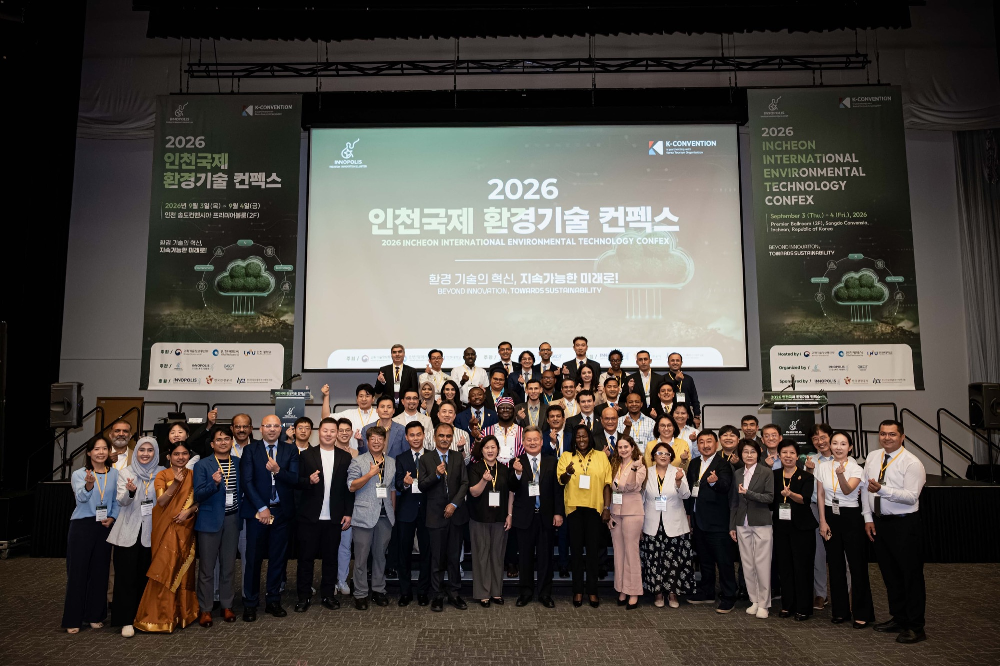
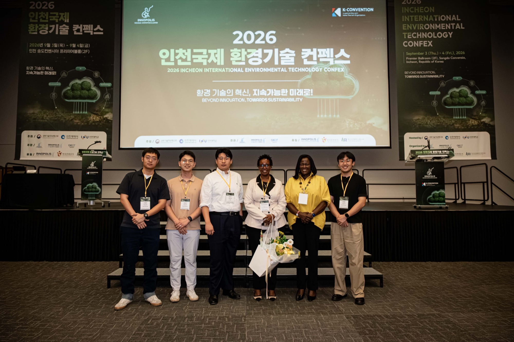

# Samton Attends the 2026 Incheon International Environmental Technology Confex

On 4 September 2026, Samton attended the **5th Incheon International Environmental Technology Confex** at Songdo Convensia in Incheon.

*A commemorative group photo with participants at the 2026 Incheon International Environmental Technology Confex*

The event took place over two days, from 3 to 4 September, at Songdo Convensia. Hosted by the Ministry of Science and ICT, Incheon Metropolitan City and Incheon National University, it was held under the theme **“Beyond Innovation, Towards Sustainability.”**

At the event, Samton met **Emmy Jerono Kipsoi, Kenya's Ambassador to the Republic of Korea**, to discuss **environmental and energy projects in Kenya and the potential use of digital monitoring, reporting and verification (DMRV)**. They exchanged views on the role DMRV could play in continuously collecting energy use and environmental data from sites in Kenya and connecting that data to verifiable records.

*Emmy Jerono Kipsoi, Kenya's Ambassador to the Republic of Korea, with Samton*

At the event, Samton also met **Bernadette Therese C. Fernandez, the Philippine Ambassador to the Republic of Korea**, and introduced its DMRV technology and business direction. They discussed the potential use of field data in the Philippines' environmental and energy sectors, as well as opportunities for future exchanges.

Through its planned DMRV pilot in Kenya, Samton aims to examine local conditions for data collection and practical operational challenges. Samton will continue refining the technology and operating structure of Samton-DMRV to support reliable field data collection and traceable supporting evidence.

::bookmark[2026 Incheon International Environmental Technology Confex Official Website](https://www.iicconfex.or.kr/)
Incheon International Environmental Technology Confex · Event overview
image: images/samton-incheon-confex-group.jpg
