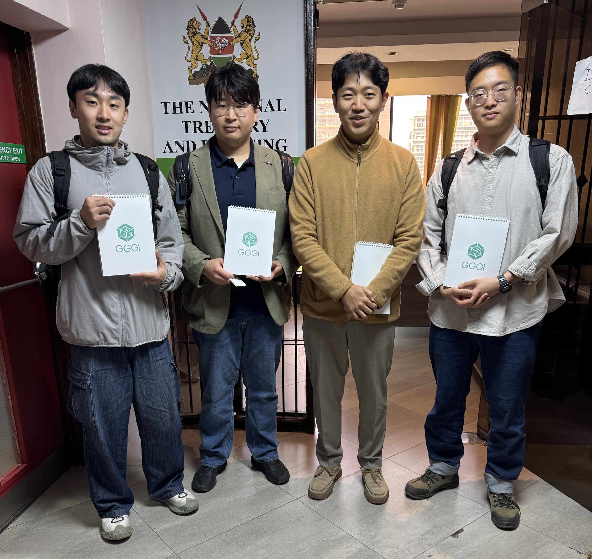

# Samton、GGGIケニア事務所とケニアでのDMRV事業展開を協議

Samtonはケニア出張中、**グローバル・グリーン成長研究所（GGGI）ケニア事務所**を訪問し、現地におけるDMRV事業の方向性について意見を交わしました。

*GGGIケニア事務所で現地DMRV事業の方向性を協議した後に撮影した記念写真*

Samtonは、ケニア北部サンブル地域の太陽光ミニグリッドを対象に準備しているSamton-DMRV PoCを紹介しました。また、現地で収集する発電量と電力使用量のデータを排出削減成果につなげ、地域の電力アクセスと持続可能な運営をともに向上させる計画も共有しました。

さらに、DMRVをケニアのグリーン成長・開発協力事業に適用する際に考慮すべき現地条件と実行の方向性についても意見を交わしました。

今回の訪問は、正式な協約に向けた場ではなく、現地の経験と視点を学ぶための意見交換でした。Samtonはこの議論を踏まえ、サンブル地域の環境と事業構造に合ったDMRV実証モデルを具体化していきます。
