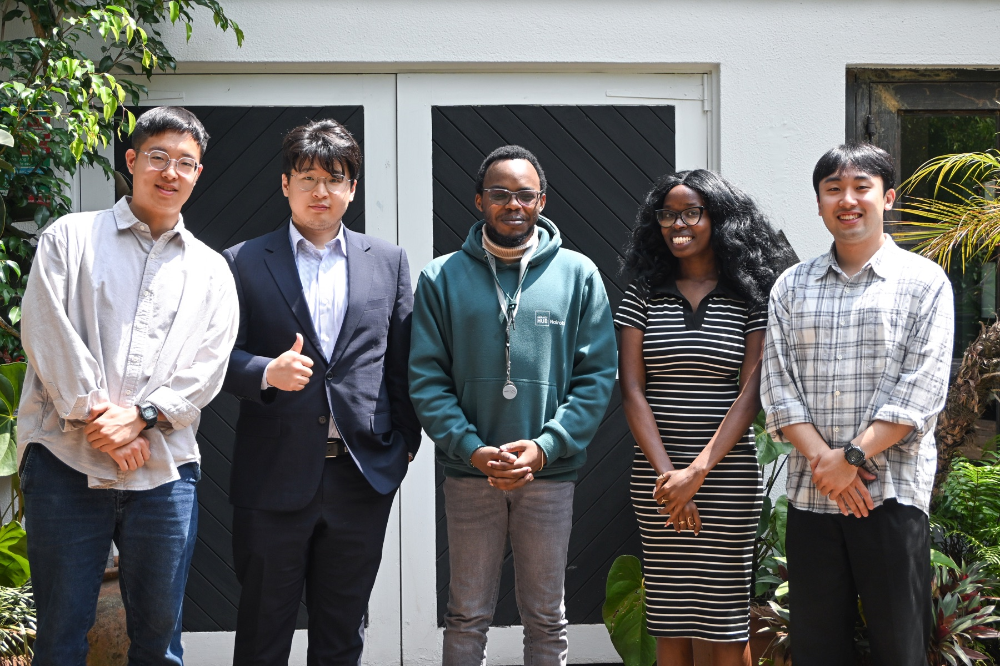
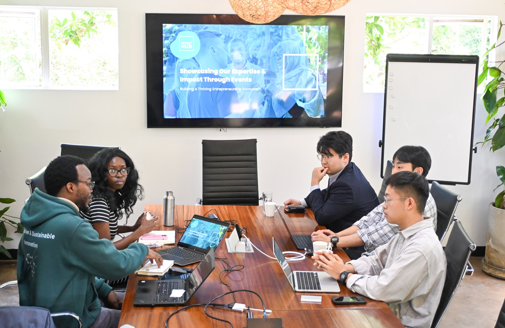
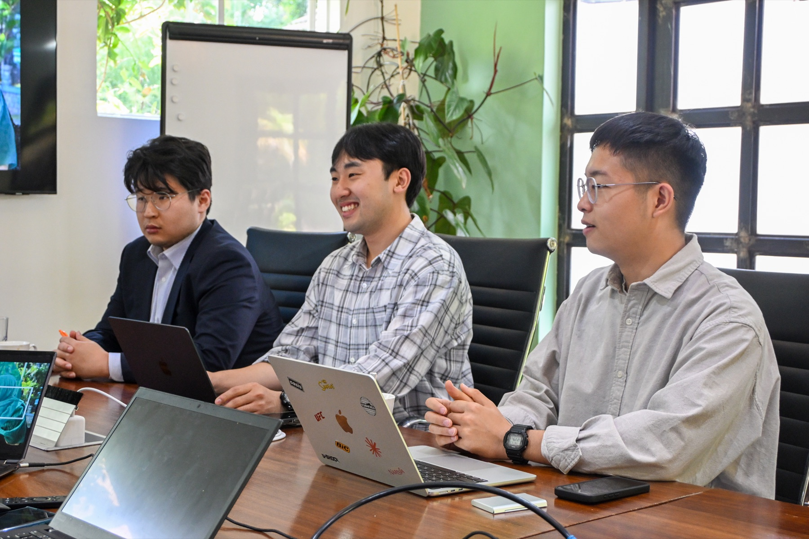

# Samton and Impact Hub Nairobi Discuss a Collaboration Network for a Kenya DMRV PoC

During its 2026 field visit to Kenya, Samton visited **Impact Hub Nairobi** to discuss building a network for the local implementation and expansion of the Samton-DMRV PoC.

The meeting covered Samton's plan to demonstrate DMRV for a solar mini-grid in Samburu, northern Kenya, and explored ways for local private operators, investors and the impact-startup ecosystem to participate in the project.

*Samton and Impact Hub Nairobi representatives*

## The network required for local implementation

The Samton-DMRV PoC will directly meter electricity generation and consumption from a solar mini-grid and connect those measurements to carbon-reduction calculations and verifiable monitoring data. Reliable local operation requires more than software. It also requires implementation partners capable of equipment procurement, construction, maintenance and community support.

It is particularly important to identify solar and mini-grid operators suited to conditions in Lesuruwa and to establish a collaboration model that can expand to neighboring areas after the PoC. Through this meeting, Samton reviewed the technical and operational capabilities of local companies and discussed how they could connect with Samton-DMRV.

*Discussing local implementation of the Samton-DMRV PoC at Impact Hub Nairobi*

## Areas of collaboration discussed with Impact Hub Nairobi

Impact Hub Nairobi is an entrepreneurship-support network that connects impact ventures and founders with investors and support organizations across Nairobi. Drawing on its local ecosystem and commercialization experience, Samton discussed the following possibilities:

- identifying candidate solar and mini-grid operators in Kenya;
- connecting with implementation partners capable of procurement, construction and maintenance;
- expanding follow-on commercialization networks through impact investors and accelerators; and
- exploring partnerships that could extend the Lesuruwa PoC to other underserved areas in Kenya.

This network can position local companies not merely as suppliers but as long-term operating partners, helping the data and outcomes generated by the demonstration lead to subsequent projects.

*The Samton team explains the Kenya DMRV PoC and directions for local partnership*

## Connecting the PoC with the local ecosystem

In addition to its collaboration with the Samburu community and local NGO partners, Samton aims to improve both the feasibility and scalability of the PoC by connecting it with Nairobi's business and investment networks. The model builds community participation and trust in the field while identifying technology, procurement and investment partners in the city's business ecosystem.

Based on these discussions, Samton plans to compare the experience and delivery capabilities of potential local solar operators and define the roles and scope of collaboration required during the PoC. It will also continue discussions with Kenyan impact ventures and investment organizations about further expansion based on the generation, consumption and carbon-reduction data produced by the demonstration.

The visit to Impact Hub Nairobi marked the starting point for identifying the partner ecosystem needed to apply Samton-DMRV in Kenya and for developing an implementable model together with local businesses.
