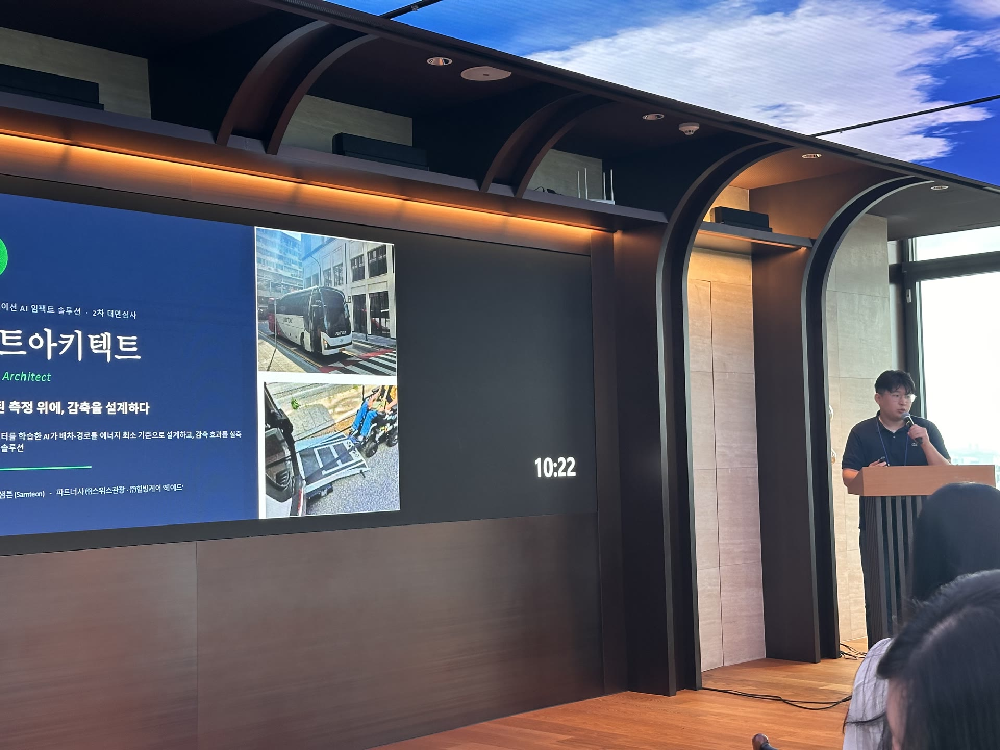
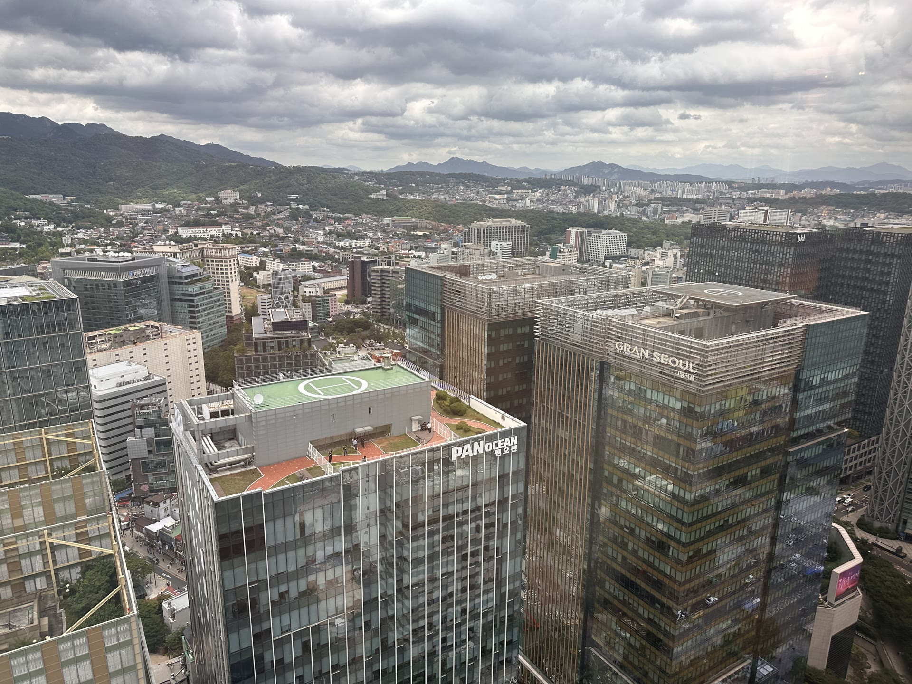
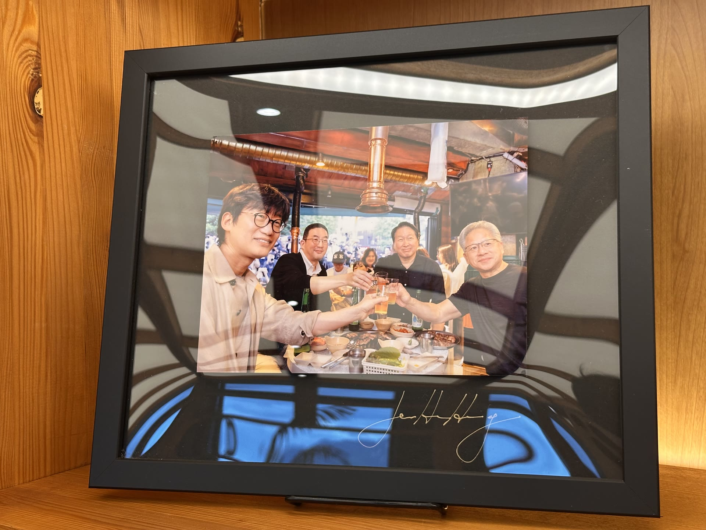

# Samton、SK Innovation「AI Impact Solution」でRoute Architect PoCを開始

SamtonはSK Innovationが主催する**AI Impact Solution**に「Route Architect」として参加し、2026年7月14日にキックオフ・ブートキャンプを開始しました。

[AI Impact Solution](https://skimpactai.com/)は、AIを活用してエネルギー・社会課題を解決するチームを選抜し、PoC開発、専門家メンタリング、事業化を支援するプログラムです。Samtonは、エネルギー効率化と炭素削減を扱う**Track A: AI for Energy**で実証を進めます。

*SK Innovation AI Impact SolutionでRoute Architectの課題と解決方法を発表する様子*

## 最速の道ではなく、エネルギー使用が最も少ない道

通勤バス、貸切バス、移動困難者向け支援車両の現場では、複数の車両、予約、時刻表を同時に考慮して配車する必要があります。しかし、運転者個人のナビゲーションと手作業の配車に依存するケースも多く、複数車両が類似経路を繰り返したり、乗客を乗せずに走る空車距離が生じやすい状況です。

Route Architectは単に移動距離が短い経路を探すだけではありません。実際の運行記録であるDTGデータと予約・需要情報をAIが学習し、燃料とエネルギーの使用を最小化する配車と経路を設計します。

このプロセスでは四つのAI機能が連携します。

- 路線・時間帯別の乗車需要と予約パターンの予測
- 車両・路線・時間を同時に考慮した配車最適化
- 区間と運転行動に応じたエネルギー消費量の予測
- 複数の配車・経路シナリオにおける炭素とコストの比較

定期運行する通勤バスだけでなく、予約時間や車椅子スペースなど多様な条件を考慮する必要がある移動支援車両にも同じ最適化構造を適用することを目指しています。

## 測定し、削減し、再び検証する

Route Architectの核心は、AIが提案した経路で終わらない点にあります。運行前データからベースラインを設定し、最適化した配車と経路を実車に適用した後、燃料使用量と炭素排出量がどれだけ変化したかを**Samton-DMRV**で再確認します。

> 測定、最適化、検証を一つの流れでつなぎ、削減効果を主張ではなくデータで証明します。

検証結果は再びAIモデルの学習データになります。現場データを継続的に蓄積するほど、車両と路線の特性に合った予測と最適化が可能になります。企業にとっては、蓄積されたデータが燃料費の実質的な削減だけでなく、輸送に伴うScope 3排出量を管理する基盤にもなります。

*Route Architect PoCの実施計画を具体化したAI Impact Solutionキックオフ・ブートキャンプ*

## 通勤バスと移動支援サービスで検証

今回のPoCは異なる二つの運行現場を対象に計画されています。パートナーである**Swiss Tour**の通勤バス3〜5路線と、**Healbeing Care**の移動支援サービス「HAID」の車両2〜3台を対象に、実際の運行データを取得し、AI配車・経路最適化の効果を検証する予定です。

7月に対象路線とベースラインを設定し、8月にAIモデルの学習とエンジン試作を行います。9月以降に実車へ適用して運行し、10月にSamton-DMRVで削減効果を検証してモデルを高度化します。燃料使用量、空車距離、配車待ち時間、炭素削減量が主な検証指標です。

現在示している数値は達成結果ではなく、PoCで検証する目標です。Samtonは実車から収集したデータをもとに最適化前後を比較し、どの条件で削減効果が生じるかを具体的に確認します。

## エネルギー削減を移動権の改善へつなぐ

運行経路が効率化されれば、燃料と炭素排出量だけでなく運営費も削減できます。通勤バス事業者にとっては持続可能な車両運用と企業顧客の炭素データ管理基盤となり、移動支援サービスでは迅速な配車と安定したサービス運用につながります。

特に移動支援車両では、最短距離だけでなく、予約時間、乗降支援、車椅子対応可否など多様な条件を同時に反映しなければなりません。Route Architectはこうした現場制約をAIが考慮するよう設計し、エネルギー効率と移動の利便性を同時に高めます。

*キックオフ会場に展示されていた、いわゆる「カンブチキン会合」の記念写真*

## 現場データでAIの効果を証明する

キックオフ会場の一角には、AI産業協業を象徴する場面として知られる「カンブチキン会合」の記念写真も展示されていました。異なる産業と技術が出会うことで新たな実行可能性が開かれるという点で、今回のプログラムの方向性とも重なる場面でした。

SamtonがRoute Architectで実現しようとしているのも、技術を切り離さない構造です。AIは実際の運行データから削減方法を設計し、Samton-DMRVはその変化が現場で起きたかを検証します。運輸事業者と移動サービス運営者は、検証済みデータを再び運用改善と炭素管理に活用できます。

SamtonはAI Impact SolutionのメンタリングとPoCを通じてRoute Architectのモデルと現場適用方法を具体化し、実運行で確認したエネルギー・炭素削減データを成果として提示します。
