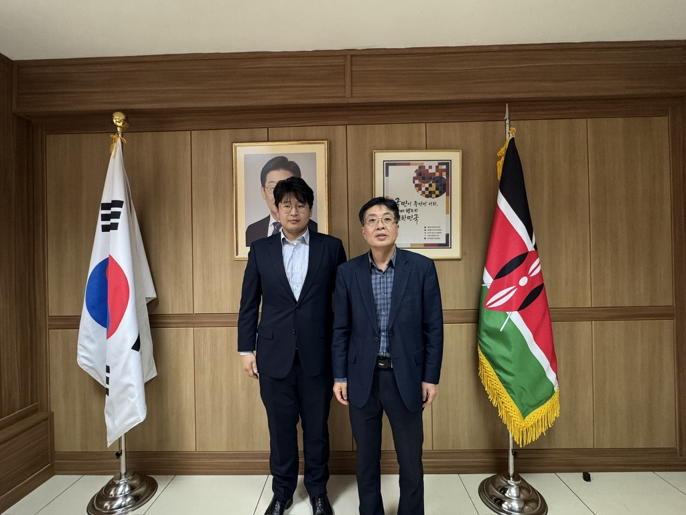

# 샘튼, 주케냐 대한민국 대사관 참사관과 현지 DMRV 방향 논의

샘튼은 케냐 현지 출장 중 우연히 마련된 인연을 통해 **주케냐 대한민국 대사관 참사관**과 만나 짧게 의견을 나눴습니다.

*주케냐 대한민국 대사관에서 한·케냐 기후·에너지 정책 방향과 DMRV의 역할에 관해 의견을 나눈 뒤 촬영한 기념사진*

이번 대화에서는 개별 사업의 추진 여건보다 **한국과 케냐 정부가 바라보는 기후변화 대응, 에너지 접근성 확대와 개발협력의 방향**을 중심으로 의견을 나눴습니다. 양국의 정책적 흐름이 현장의 기후·에너지 사업과 어떻게 연결될 수 있는지, 그 과정에서 신뢰할 수 있는 데이터가 어떤 역할을 할 수 있는지도 함께 이야기했습니다.

샘튼은 케냐 북부 삼부르 지역에서 준비하고 있는 태양광 미니그리드 기반 Samton-DMRV PoC를 소개했습니다. 발전량과 전력 사용량 같은 현장 데이터를 지속적으로 수집하고 검증 가능한 감축성과로 연결하는 DMRV가, 개별 프로젝트의 성과관리뿐 아니라 향후 양국의 기후기술·개발협력 사업을 설명하는 데이터 기반으로 활용될 가능성에 관해서도 의견을 나눴습니다.

공식 협약이나 정책 협의를 위한 자리는 아니었지만, 삼부르 현장에서 준비하고 있는 DMRV 실증을 한·케냐 양국의 기후·에너지 협력이라는 더 넓은 맥락에서 바라볼 수 있었던 시간이었습니다.

샘튼은 앞으로도 양국의 정책 방향과 현장의 필요를 함께 살피며, 삼부르 지역에서 축적되는 데이터가 실질적인 기후성과와 지속 가능한 협력으로 이어질 수 있도록 실증 구조를 구체화해 나가겠습니다.
