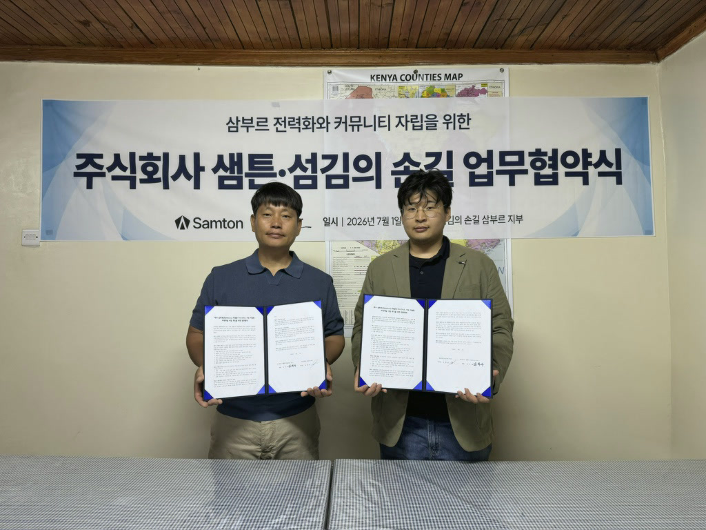
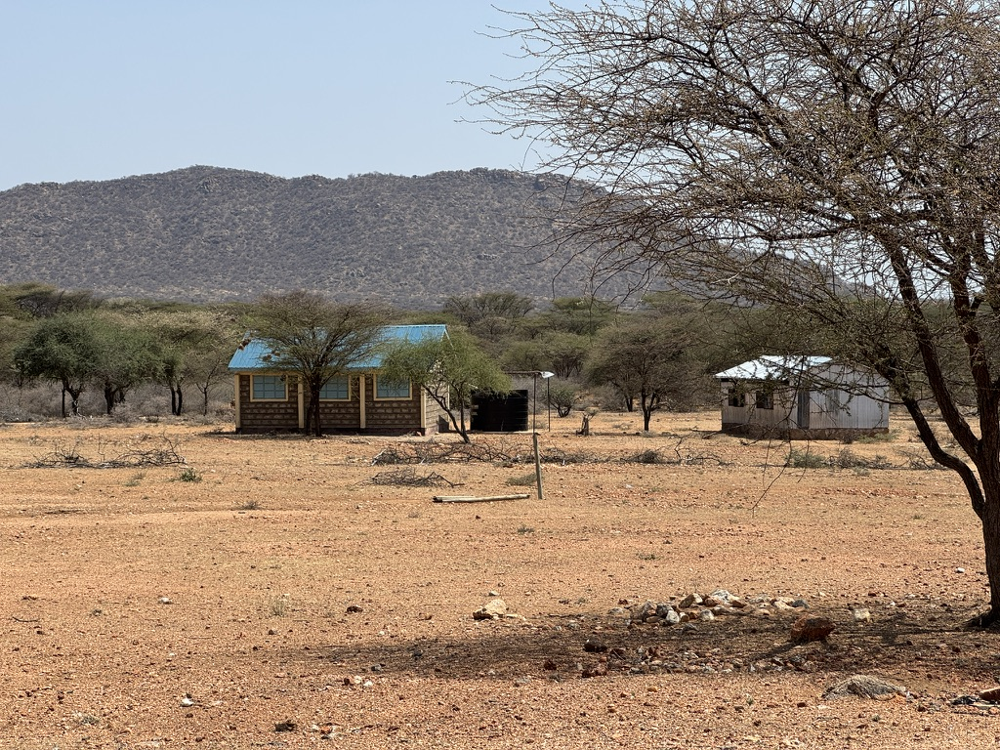
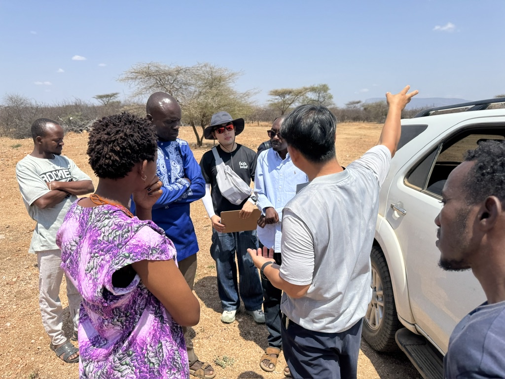

# Samton Builds the Foundation for a Samburu DMRV PoC with a Kenyan NGO

Samton visited Kenya from June 27 to July 6, 2026, to build a partnership foundation for improving electricity access in Samburu, northern Kenya, and demonstrating Samton-DMRV in the field.

During the visit, Samton signed an MOU with local NGO **Serving Hands Society**. The two organizations agreed to collaborate on a PoC combining a solar mini-grid with digital monitoring, reporting and verification (DMRV), and to develop a sustainable operating model together with the local community.

*MOU ceremony between Samton and Serving Hands Society*

## A PoC that begins with the local community

Samton's proposed project will install a solar mini-grid in an underserved area of Samburu County and use Samton-DMRV to directly measure and verify electricity generation and consumption data. Rather than stopping at equipment installation, the project aims to verify the full process through which field data becomes evidence of carbon reductions and supports carbon-credit issuance.

The field survey compared candidate sites including Namayiana, Kiltamani, Lesuruwa and Lerata A based on electricity demand, land, accessibility, communications and community cooperation. **Lesuruwa**, home to approximately 200 households and covered by the Safaricom network, was selected as the PoC site.

## Conditions confirmed directly in Lesuruwa

*The field site in Lesuruwa, Samburu County, northern Kenya*

Lesuruwa is an arid area where homes and small facilities are widely dispersed, making extension of the central grid difficult. The field survey examined the proposed mini-grid site, nearby facilities, residents' movement patterns, vehicle access and communications conditions.

Together with local stakeholders, Samton and Serving Hands Society discussed the PoC site's boundaries, electricity demand, equipment layout and future maintenance. This field information provides the basis not only for sizing the solar system but also for deciding where meters should be installed, how data should be transmitted and how operations should be organized.

*Reviewing the PoC site and operating conditions with Lesuruwa stakeholders*

Because of the dry, dusty environment, the distance between facilities and limited site access, the project must plan for equipment durability and remote inspection. The system will also support local storage and retransmission so metering data is not lost during temporary communications outages.

## A partnership grounded in trust

Serving Hands Society has worked in Samburu for more than six years and built trusted relationships with local communities. The partnership creates a foundation for incorporating local voices throughout the project, from site consultations and demand surveys to field operation and follow-up management.

Following consultation with the community, Samton secured consent to use the PoC site. This is important because the project is not imposing technology from outside; it is building relationships that allow residents to understand and participate in the project's purpose and operating model.

> Trustworthy DMRV begins not only with accurate technology, but also with the consent and participation of the places and people who create the data.

## Improving electricity access and trust in carbon data together

The PoC aims to supply electricity to 50 households and more than 100 people through the solar mini-grid. It will directly meter generation and consumption for at least 90 days, check for missing and anomalous data, and connect carbon-reduction calculations and monitoring reports in one continuous process.

Samton and its local partners will next detail beneficiary agreements, baseline surveys and the process for free, prior and informed consent. They will also prepare local operator training and a data-collection framework so the community can sustain the equipment and operational capacity after the demonstration.

The MOU and community consent mark the first step toward applying Samton-DMRV in a real development-cooperation setting. Drawing on data and partnership experience from Lesuruwa, Samton will develop a verifiable model that connects improved electricity access with carbon finance.
