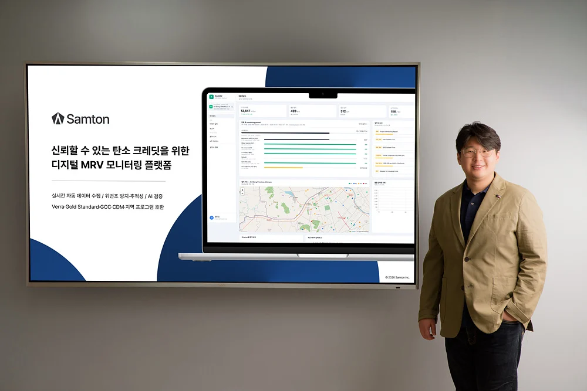

# Samton Featured by Hankyung JOB&JOY as a Digital MRV Company

Samton was featured in the **Startup CEO** section of Hankyung JOB&JOY on July 24, 2026.

Published as part of a series on companies participating in the Daegu Center for Creative Economy & Innovation’s 2025 Public-Private Open Innovation Support Program, the article highlighted Samton’s two MRV solutions and key collaboration cases. Both solutions are designed to turn field data into reliable carbon information.

*Samton CEO Deok-su Shim and the digital MRV platform featured by Hankyung JOB&JOY*

## Two MRV solutions highlighted in the article

The article first introduced **Eco Samton**, a mobility MRV solution that standardizes transport and logistics data to monitor, report, and verify carbon emissions. It connects fragmented operational data in a consistent workflow and helps companies move beyond understanding their emissions toward making informed reduction decisions.

It also covered Samton’s **emissions-reduction DMRV solution**, which integrates data from sources such as satellite imagery, field IoT sensors, and operational records to quantify emission reductions under international methodologies. The platform supports the workflow from project monitoring to report preparation and the evidence needed for carbon credit issuance, helping project developers manage complex data and procedures more systematically.

## The collaboration with Kakao Mobility was also featured

Through the support program, Samton has worked with Kakao Mobility on a joint research and development project. The article explained that Samton is building a customized DMRV system that collects and calculates mobility data at the trip level and connects the results to reports aligned with disclosure requirements.

By designing an architecture capable of handling millions of data records per day, the project aims to provide reliable Scope 3 data from business travel and employee commuting, as well as emissions data directly managed by mobility companies.

## Turning field data into trusted carbon information

The feature shows that Samton’s MRV is more than a carbon calculation tool. Carbon data can support reduction decisions, disclosure, and carbon credit issuance only when field data is collected, calculated under the appropriate rules, and retained in a form that can be reviewed and verified.

With mobility MRV and emissions-reduction DMRV as its two pillars, Samton will continue building the infrastructure that helps companies and project developers understand and use their carbon data with greater confidence.

[Read the full Hankyung JOB&JOY article](https://magazine.hankyung.com/job-joy/article/202607217920d)
