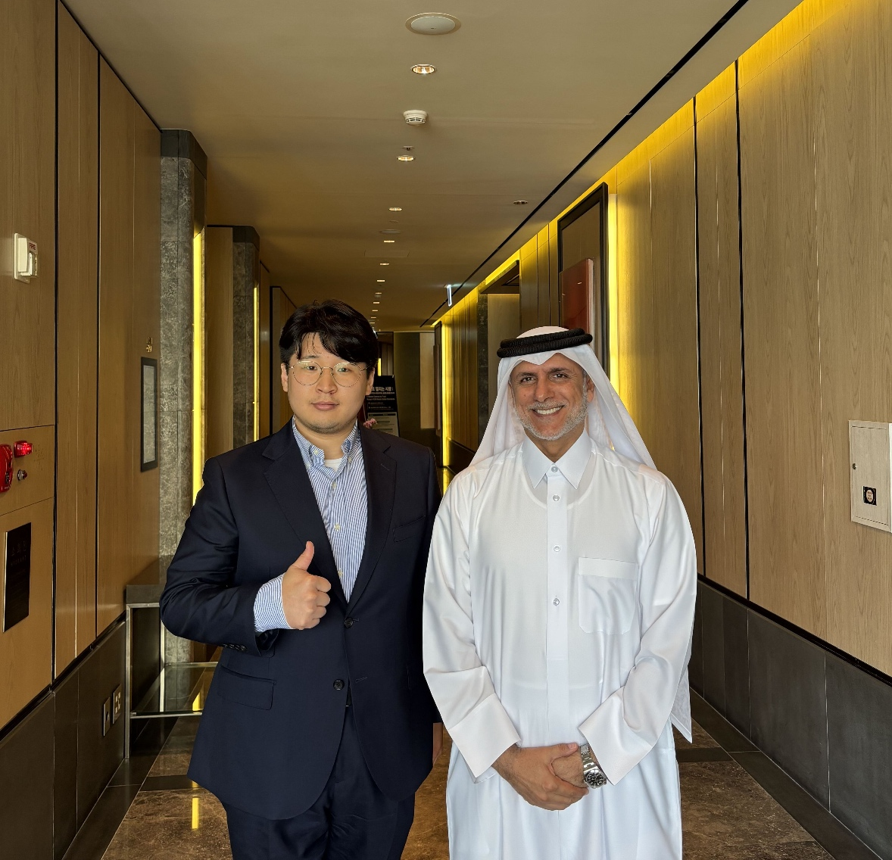
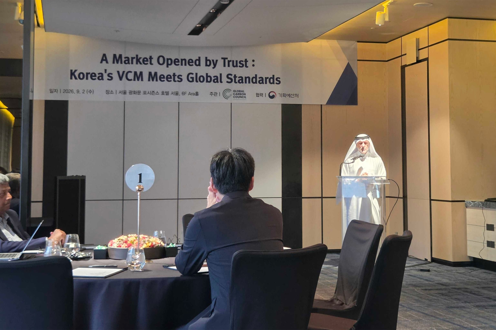

# Samton Participates in Event on Building Korea's Voluntary Carbon Market Ecosystem

On 2 September 2026, Samton attended an **event on building Korea's voluntary carbon market ecosystem** at the Korea Chamber of Commerce and Industry in Seoul. There, Samton met Dr. Yousef Mohammed Alhorr, Founding Chairman of the Global Carbon Council (GCC), and exchanged views on building a trusted carbon market and the direction of digital monitoring, reporting and verification (DMRV).

*Samton CEO Deok-su Shim with GCC Founding Chairman Dr. Yousef Mohammed Alhorr at the event on building Korea's voluntary carbon market ecosystem*

On the same day, Korea's Ministry of Planning and Budget, the Korea Chamber of Commerce and Industry, and GCC signed a memorandum of understanding to help expand Korea's voluntary carbon market (VCM) and establish a basis for connecting it with international markets. The three institutions said they plan to share experience in carbon credit methodologies and registry operations, support the international use of mitigation outcomes generated in Korea, and cooperate in responding to international carbon market rules. Yonhap News Agency reported that the specific areas of cooperation include alignment with international standards, advice on standards and methodologies, the international standardization of new methodologies, and links between digital MRV and registries. The related coverage and official material are available below.

*GCC Founding Chairman Dr. Yousef Mohammed Alhorr speaking at “A Market Opened by Trust: Korea's VCM Meets Global Standards”*

::bookmark[Global Carbon Council (GCC) Chairman's Message](https://globalcarboncouncil.com/about/chairmans-message/)
Global Carbon Council · Official chairman profile
image: images/samton-gcc-chairman-yousef-alhorr.jpg

::bookmark[Strengthening Cooperation with Qatar's Global Carbon Council to Expand the Voluntary Carbon Market Ecosystem](https://admin.korea.kr/briefing/pressReleaseView.do?newsId=156777524&pWise=mSub&pWiseSub=C5)
Ministry of Planning and Budget · 2 September 2026
image: images/bookmark-mou-signing.jpg

::bookmark[Government Partners with GCC to Grow Voluntary Carbon Market and Purchase Up to 200,000 Tonnes of Credits](https://www.ajunews.com/view/20260902105118151)
Aju Business Daily · 2 September 2026
image: images/bookmark-ajunews-government.jpg

::bookmark[KCCI, Ministry of Planning and Budget and GCC Link Korea's Voluntary Carbon Market to Global Markets](https://www.yna.co.kr/view/AKR20260901168800003?input=kkt)
Yonhap News Agency · 2 September 2026
image: images/bookmark-mou-signing.jpg

**Trust** was the central theme of the event. For carbon mitigation outcomes to be recognized in the market, an appropriate methodology, consistent field data, a transparent registry and independent verification must work together. Digital MRV can provide the foundation for collecting field data without gaps and tracing calculation evidence and change histories.

This meeting was an exchange of views at the event, not a separate agreement or partnership. Through Samton-DMRV, Samton will continue refining the technology and operating structure needed to connect energy use and mitigation data from the field to verifiable records and help Korean mitigation activities build trust in line with international standards.
