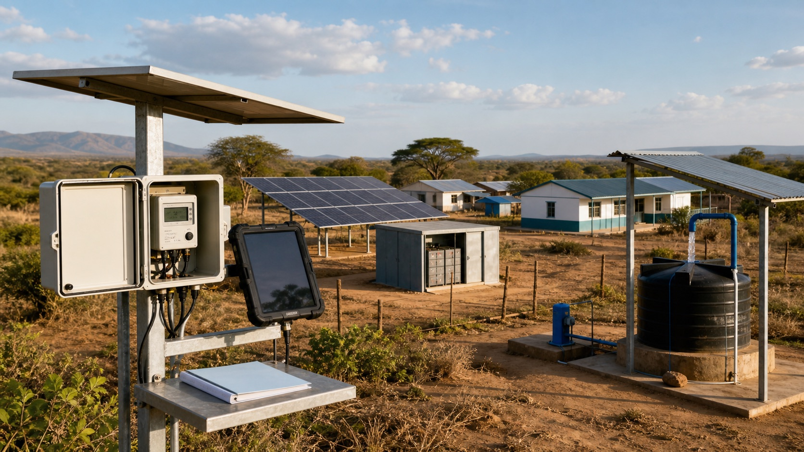

# ODAと炭素クレジットの接点

*開発資金で構築した地域エネルギーインフラの運営成果を現場データで確認できる環境*

途上国の村に太陽光設備やクリーンクッキング機器を普及すると考えてみましょう。

最初に設備の購入・設置資金が必要です。電力を管理する人材の教育、故障時の修理体制、政府が事業を管理する制度とデータシステムも必要です。

こうした初期基盤には、ODAや世界銀行など多国間開発銀行の資金が使われます。しかし支援事業が終わった後も設備を維持し、より多くの村へ広げるには新しい収益が必要です。

炭素クレジットは後続資金になり得ます。太陽光やクリーンクッキングによって実際に温室効果ガスが減ったことを確認し、削減量をクレジットとして販売すれば新たな収益が生まれるからです。

クレジット方法論は販売前にも役立ちます。どのデータを集め、削減効果をどう計算し、誰が結果を確認するかをあらかじめ示せるため、ODA・気候基金の提供機関が成果を判断する根拠にもなります。

> **ODAが事業を始める呼び水なら、炭素クレジットは実際の削減が確認された後に生まれる成果収益です。**

## ODAとカーボンファイナンスは役割が異なる

ODAを含む公的開発資金は主に事業開始段階で使われます。

- 太陽光、ミニグリッド、クリーンクッキング機器の設置
- 低所得世帯が利用できるよう価格を引き下げる支援
- 現地運用人材と政府担当者の教育
- 事業管理の制度とデータシステムの構築
- 民間企業が新地域へ参入する際のリスク低減

炭素資金は通常その後に生まれます。設備の実利用を確認し、従来よりどれだけ温室効果ガスが減ったかを計算し、独立機関が検証して初めてクレジットを発行・販売できます。

つまりODAは**削減が起こり得る環境をつくる資金**、クレジット収益は**実際に起きた削減成果から生まれる資金**です。

## 炭素方法論は成果を測る共通基準になる

ODAや気候基金への申請では「良い事業を行う」という計画だけでは足りません。資金提供機関は、予算がどの変化を生むか確認する必要があります。

例えばクリーンクッキング事業では、次の問いに答えなければなりません。

- 従来どの燃料をどれだけ使っていたか。
- 新機器で燃料使用がどれだけ減るか。
- 機器が実際に使われていることをどう確認するか。
- どの計算式で温室効果ガス削減量を算定するか。
- 誰が調査結果をレビュー・検証するか。

炭素方法論には、これらに答えるベースライン、事業境界、収集データ、計算式、検証手続きが含まれます。事業前に構造を整えれば予想削減量を共通基準で計算でき、開始後も実績が計画どおりか確認できます。

方法論とMRVは発行のためだけでなく、**事業が生み出す気候成果を説明する共通言語**にもなります。

世界銀行は、成果連動型気候金融で削減成果を確認するMRVが、炭素市場で削減量を証明する際にも使われると説明します。成果確認後に補助金や成果支払いを行い、同じデータ基盤からクレジット発行へつなげることもできます。[世界銀行：成果連動型気候金融](https://www.worldbank.org/en/news/feature/2022/08/17/what-you-need-to-know-about-results-based-climate-finance)

また多国間開発銀行は、支援額だけでは実際の成果が分からないため、削減と適応の結果を共通方式で測る体系が必要だとしています。[世界銀行：気候成果の共通測定アプローチ](https://www.worldbank.org/en/topic/climatechange/publication/common-approach-to-measuring-climate-results)

信頼できる方法論とデータ計画があれば、次の点を明確に示せます。

- 支援金で目指す削減効果の規模
- 成果データの出所と収集方法
- 事業中に確認する指標
- 終了後も結果を検証できる根拠
- 成果連動型気候金融・炭素市場への接続可能性

準備だけで承認が保証されるわけではありません。開発機関は貧困削減、エネルギーアクセス、地域便益、費用の妥当性、環境・社会セーフガードも評価します。それでも方法論は、気候効果を期待ではなく確認可能な数値とデータで提示できるようにします。

## 炭素クレジットは事業の継続を後押しできる

開発事業は支援期間後に運営費が不足することがあります。設備が故障しても修理できず、成功事業を他地域へ広げられない場合もあります。

クレジット収益を維持管理、新規普及、利用者支援へ再投資すれば、一度の支援で終わる事業を継続・拡大できる可能性が生まれます。

ルワンダのクリーンクッキング事業では、まず世界銀行IDA資金とClean Cooking Fundの助成金が投入されました。その後、機器とオフグリッド設備の削減量を購入するため約1,080万ドルの炭素資金が追加されました。

世界銀行は、その収益を再びクリーンクッキング普及基金へ戻す構造を設計しました。支援金で開始し、削減成果の収益で次の普及を続ける仕組みです。[世界銀行クリーンクッキング事例](https://www.worldbank.org/en/results/2023/01/19/moving-the-needle-on-clean-cooking-for-all)

## ASCENTとは

ASCENT（Accelerating Sustainable and Clean Energy Access Transformation）は、東部・南部アフリカの電力とクリーンクッキング普及を拡大する世界銀行プログラムです。

20か国以上で次を目指します。

- 1億人へ電力アクセスを提供
- 2,000万人へクリーンクッキングを普及
- 電力網、ミニグリッド、独立型太陽光、クリーンクッキング事業を拡大

世界銀行は50億ドルの金融を用意し、官民から追加100億ドルを動員する目標です。[世界銀行ASCENT概要](https://thedocs.worldbank.org/en/doc/1233e4fb6c0f39e839979743c988fcf0-0010012024/accelerating-sustainable-and-clean-energy-access-transformation-ascent-in-eastern-southern-africa)

## ASCENT Carbonの違い

ASCENTの中で、クレジットによる追加資金をつなぐのが**ASCENT Carbon**です。

アフリカ各地には小規模な太陽光設備とクリーンクッキング機器が広く分散しています。1設備の削減量は小さく、それぞれを個別事業として登録すると調査・検証費用が高くなりすぎます。

ASCENT Carbonは各地の小規模事業を一つの大きなプログラムにまとめ、デジタル技術で利用データと削減量を集め、クレジット発行を支援します。

世界銀行は炭素市場から15億ドルの外部資金を動員する目標を示しています。開発金融で開始し、クレジットで運営・拡大資金を確保する構造です。[世界銀行Standardized Crediting Framework成果報告書](https://documents1.worldbank.org/curated/en/099051226042041782/pdf/P175764-65e54482-99d1-4796-b4c1-cfa1fe9ccfc2.pdf)

## GCCが担う役割

Global Carbon Council（GCC）はASCENT全体を設計・運営する機関ではありません。

中心的役割は、ASCENT Carbonで使う**炭素クレジット基準をつくること**です。対象設備、削減量計算、確認資料などの共通ルールを開発します。複数国の多数設備を同じ基準で評価するために必要です。

GCCは事業登録、データ確認、検証報告、発行をつなぐデジタルポータルも実装・運営します。[GCC ASCENT Carbon Program](https://globalcarboncouncil.com/how-gcc-works/energy-access-program/)

つまりGCCはASCENT全体の設計者ではなく、**ASCENT Carbonの基準をつくり、デジタル発行体系を運営する機関**です。

## なぜDMRVが必要か

設備を設置した写真だけではクレジットをつくれません。

1万世帯へクリーンクッキング機器を配布したなら、次を確認する必要があります。

- 実際に設置されたか。
- 利用者が継続使用しているか。
- 薪・木炭使用がどれだけ減ったか。
- 温室効果ガスがどれだけ減ったか。
- 計算方法と資料は信頼できるか。

この情報をデジタルで収集し、計算と検証までつなぐものがDMRVです。

ASCENTのように設備が複数国へ分散する事業では、毎回人が訪問して手作業で調べることは困難です。DMRVは設備データ、削減計算、証跡を一か所で管理し、調査費用を抑えながら根拠を確認しやすくします。

データは発行以外にも使えます。世界銀行と参加国は、設備がどこへ実際に普及したか、支援金が計画どおりの成果を生んだか、追加投資の根拠があるかを同じ基盤で確認できます。DMRVは炭素収益のシステムであると同時に、ODA・開発金融の成果を説明するシステムにもなります。

## ODA事業ならすべてクレジットをつくれるのか

そうではありません。公的資金が入っただけで自動的にクレジットが生まれるわけではありません。

クレジット収益が削減成果の創出・拡大に実際に寄与したか説明し、ODAと炭素収益の用途を透明に区分する必要があります。

さらに次を確認します。

- 削減量計算は妥当か。
- 同じ削減を複数機関が重複主張していないか。
- ホスト国が発行・海外移転を承認するか。
- 売却収益が地域住民と運営にどう還元されるか。
- 設備故障・使用停止時に削減計算も止まるか。

クレジットは不足するODA予算を単純に代替する資金ではありません。ODAで始めた事業が実際の削減を継続し、その結果をデータで証明できるときに接続する後続資金です。

## 支援事業から持続可能な削減事業へ

ODAとクレジットの接点は、単により多くの資金を得ることではありません。

ODAは初期設備、制度、現地人材をつくります。クレジットは成果を確認して新たな収益へつなぎます。収益を維持管理と次の普及へ再投資すれば、支援期間後も事業が続く可能性が高まります。

SamtonはSamton-DMRVを通じ、現場設備データから削減量計算、証跡、検証報告までをつなぎます。ODAと炭素市場を結ぶ際に最初に必要なのは販売計画ではなく、**事業が生んだ変化を誰もが確認できるデータ基盤**です。
