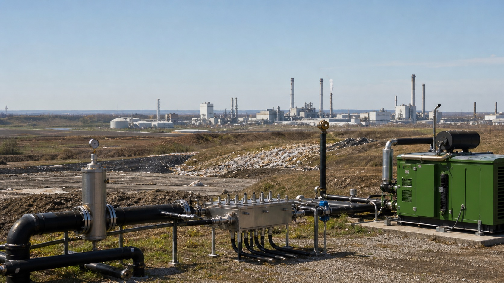

# 탄소 배출권과 탄소 크레딧의 차이

*규제 대상 산업의 배출관리와 현장 감축사업은 같은 1톤을 다루지만 서로 다른 방식으로 탄소자산을 만듭니다*

탄소시장에서는 ‘탄소 배출권’과 ‘탄소 크레딧’이라는 표현이 자주 함께 등장합니다. 둘 다 보통 이산화탄소환산량 1톤(1tCO₂e)을 하나의 단위로 표시하고 거래할 수 있어 같은 상품처럼 보이기도 합니다.

하지만 탄소 크레딧을 단순히 배출권이 부족할 때 대신 구매하는 값싼 보조수단으로 이해하면 두 시장의 역할을 제대로 설명하기 어렵습니다.

> **배출권은 정해진 배출총량 안에서 1톤을 배출할 수 있는 권리이고, 탄소 크레딧은 특정 사업이 1톤을 감축하거나 제거했다는 검증된 성과입니다.**

배출권은 규제 대상 시설의 배출총량을 관리합니다. 탄소 크레딧은 감축사업에 자금을 연결하고, 국제항공 규제와 국가 간 감축 협력, 기업의 넷제로 전략과 기후공시에서 감축 성과의 근거로 사용됩니다. 두 단위는 어느 하나가 다른 하나에 종속된 관계가 아니라, 서로 다른 문제를 해결하기 위해 만들어진 탄소자산입니다.

## 배출권은 배출총량을 관리합니다

탄소 배출권은 주로 총량제한 배출권거래제에서 만들어집니다. 정부나 규제기관이 발전, 철강, 시멘트와 같은 규제 대상 부문의 전체 배출 한도를 정하고, 그 한도에 맞춰 배출권을 할당하거나 경매로 판매합니다.

기업은 정해진 기간이 끝나면 실제 배출량에 해당하는 배출권을 제출해야 합니다. 감축을 통해 배출권이 남으면 판매할 수 있고, 배출량이 보유한 배출권보다 많으면 부족분을 시장에서 구매해야 합니다.

예를 들어 EU 배출권거래제에서 배출권 1개는 이산화탄소환산량 1톤을 배출할 수 있는 권리를 뜻합니다. 제도 전체의 배출 한도가 시간이 지나며 줄어들기 때문에 시장에 공급되는 배출권의 총량도 감소합니다. [EU 집행위원회](https://climate.ec.europa.eu/eu-action/carbon-markets/about-eu-ets_en)

배출권의 핵심은 **규제기관이 먼저 전체 배출량에 상한을 설정하고, 기업이 그 한도 안에서 배출 책임을 이행하도록 하는 것**입니다.

## 탄소 크레딧은 감축사업의 성과를 자산으로 만듭니다

탄소 크레딧은 정부가 배출 허용량을 나눠 주어 만드는 단위가 아닙니다. 재생에너지, 메탄 회수, 산림 복원, 에너지 효율과 탄소 제거 같은 사업이 기준선과 비교해 만든 온실가스 감축·제거 성과에서 시작합니다.

사업자는 승인된 방법론에 따라 감축량을 모니터링하고 보고합니다. 독립된 검증기관이 원천 데이터와 계산 결과를 확인하고, 탄소표준의 등록부가 심사를 마치면 고유번호를 가진 크레딧이 발급됩니다. 최종 사용된 크레딧은 등록부에서 취소되어 다시 사용할 수 없습니다.

이 과정은 눈에 보이지 않는 온실가스 감축을 확인 가능한 단위로 바꿉니다. 크레딧 판매로 발생한 수익은 사업의 초기 투자비와 운영비를 보완하고, 기존 수익만으로는 실행되기 어려웠던 감축사업에 기후재원이 흘러가도록 할 수 있습니다.

파리협정 제6.4조의 크레딧 메커니즘도 검증 가능한 감축 기회를 발굴하고 사업에 자금을 유치하며, 국가와 기업이 감축 성과를 이전할 수 있도록 설계되어 있습니다. 수익의 일부는 개발도상국의 기후 적응 재원으로 연결됩니다. [UNFCCC 파리협정 크레딧 메커니즘](https://unfccc.int/process-and-meetings/the-paris-agreement/article-64-mechanism)

따라서 크레딧의 가치는 단순히 ‘배출할 수 있는 권리’가 아니라 **어디에서 어떤 감축이 발생했고, 그 성과가 누구에게 이전되어 어떻게 사용됐는지를 증명하는 데** 있습니다.

탄소 크레딧이 시작된 배경과 파리협정 제6조 아래에서 중요해진 신뢰 조건은 [탄소 크레딧이 무엇인가요?](/insights/what-is-carbon-credit/)에서 자세히 살펴볼 수 있습니다.

## 탄소 크레딧은 자발적 시장에만 머물지 않습니다

탄소 크레딧은 흔히 기업이 자발적으로 구매하는 상쇄수단으로 알려져 있습니다. 하지만 오늘날에는 국제 규제와 국가의 감축목표, 기업 공시가 크레딧의 수요와 품질 기준을 함께 만들어가고 있습니다.

가장 분명한 사례가 국제민간항공기구(ICAO)의 CORSIA입니다. 항공사는 국가가 산정한 최종 상쇄 의무량만큼 **CORSIA 적격 배출단위**를 취소해야 합니다. 이때 사용하는 단위는 다른 배출권의 부족분을 보완하는 것이 아니라 CORSIA라는 국제항공 규제의 의무를 직접 이행하는 수단입니다.

아무 크레딧이나 사용할 수 있는 것도 아닙니다. ICAO 이사회가 프로그램의 설계와 환경·사회적 건전성을 심사해 승인하고, 이 가운데 적용 기간과 발급연도, 유치국 승인 등 세부 조건을 충족한 단위만 사용할 수 있습니다. ICAO가 2026년 4월 공개한 목록은 2024~2026년 첫 번째 단계뿐 아니라 이후 적용 가능한 프로그램의 범위도 구분하고 있습니다. [ICAO CORSIA 적격 배출단위](https://www.icao.int/CORSIA/corsia-eligible-emissions-units)

파리협정 제6조에서도 국가가 승인한 감축 실적을 다른 국가로 이전해 국가 온실가스 감축목표(NDC) 달성에 사용할 수 있습니다. 이때는 동일한 감축량을 두 국가가 동시에 주장하지 않도록 승인, 보고와 상응조정 같은 회계 절차가 중요합니다.

이러한 변화는 탄소 크레딧이 규제 바깥에 있는 단순한 친환경 인증서가 아니라, **국가와 산업의 규칙에 맞춰 적격성이 판단되는 감축 단위**로 발전하고 있음을 보여줍니다.

## 넷제로에서는 직접 감축과 크레딧의 역할을 구분해야 합니다

탄소 크레딧의 중요성이 커진다고 해서 기업이 내부 감축 대신 크레딧만 구매해 넷제로를 달성할 수 있다는 뜻은 아닙니다.

과학기반감축목표 이니셔티브(SBTi)의 기업 넷제로 기준은 가치사슬 안의 배출을 먼저 빠르고 깊게 줄이는 것을 우선합니다. 장기 목표에서는 가능한 배출을 통상 90% 이상 감축하고, 끝까지 제거하기 어려운 잔여배출은 영구적인 탄소 제거와 저장으로 중화하도록 설명합니다. 동시에 기업이 자체 감축목표와 별도로 가치사슬 밖의 감축 활동에도 투자할 것을 권고합니다. [SBTi Corporate Net-Zero Standard](https://sciencebasedtargets.org/corporate-net-zero)

여기서 크레딧은 두 가지 의미를 가질 수 있습니다.

- 넷제로 시점에 남는 잔여배출을 고품질 탄소 제거로 중화하는 수단
- 기업의 자체 감축과 별도로 다른 지역과 부문의 추가적인 기후행동에 자금을 제공하는 수단

중요한 것은 크레딧 구매와 기업 내부의 직접 감축을 한 숫자로 섞지 않는 것입니다. 감축 우선순위와 사용 목적을 분명히 할 때 탄소 크레딧은 면죄부가 아니라 추가 기후행동을 만들어내는 수단이 될 수 있습니다.

## 기후공시는 어떤 크레딧을 왜 사용하는지 묻습니다

기후공시 기준도 탄소 크레딧의 사용을 더 투명하게 만들고 있습니다. IFRS S2를 적용하는 기업이 순 온실가스 배출목표 달성에 탄소 크레딧을 사용할 계획이라면, 단순히 구매량만 밝히는 것으로 끝나지 않습니다.

기업은 목표 달성이 크레딧에 어느 정도 의존하는지, 어떤 제3자 인증제도가 검증하는지, 자연기반 또는 기술기반 제거인지, 감축 크레딧인지 제거 크레딧인지 등을 공개해야 합니다. 크레딧의 영구성과 같은 신뢰성 판단 요소도 설명 대상입니다. [IFRS S2 기후 관련 공시 기준, 문단 36(e)](https://www.ifrs.org/issued-standards/ifrs-sustainability-standards-navigator/ifrs-s2-climate-related-disclosures/)

IFRS S2가 기업에 크레딧 구매 자체를 의무화하는 것은 아닙니다. 대신 넷제로 목표에 크레딧을 사용한다면 **얼마나 의존했고 어떤 품질의 단위를 선택했는지 투자자가 확인할 수 있도록 요구합니다.**

이는 기업이 가격만 보고 크레딧을 구매하기 어려워진다는 의미입니다. 적격성, 검증체계와 원천 데이터가 공시의 신뢰성과 기업의 평판에 직접 연결되기 때문입니다.

## 같은 1톤이라도 가치와 가격은 달라집니다

배출권과 탄소 크레딧은 모두 1톤 단위이지만 가격을 결정하는 요인이 다릅니다.

배출권 가격은 규제기관이 정한 전체 배출 한도, 배출권 공급량, 규제 대상 기업의 실제 배출량, 에너지 가격과 정책 변화에 영향을 받습니다. 정해진 기한까지 제출해야 하는 규제 의무가 수요의 기반입니다.

탄소 크레딧 가격은 사업 유형과 지역, 적용한 방법론, 발급연도, 추가성과 지속성, 유치국 승인 여부, 구매자가 사용하려는 제도의 적격성에 따라 달라집니다. 같은 1톤이라도 어떤 의무와 목표에 사용할 수 있는지, 감축의 품질을 얼마나 신뢰할 수 있는지에 따라 가치가 달라집니다.

그렇다고 모든 탄소 크레딧 가격이 일괄적으로 오르고 있다고 말할 수는 없습니다. 세계은행의 「State and Trends of Carbon Pricing 2026」에 따르면 2025년 전체 크레딧 발급량은 전년보다 8% 늘었지만, 평균적인 크레딧 가격은 소폭 하락했습니다. 반면 국제항공 규제에 사용할 수 있는 크레딧과 높은 평가를 받은 산림 보전·재조림 사업의 크레딧에는 가격 프리미엄이 이어졌습니다. [World Bank, State and Trends of Carbon Pricing 2026](https://www.worldbank.org/en/publication/state-and-trends-of-carbon-pricing)

이는 시장이 모든 크레딧을 같은 상품으로 평가하기보다 **사용 가능한 제도와 감축 품질에 따라 가격을 구분하기 시작한 것**으로 해석할 수 있습니다. 앞으로 중요한 것은 막연한 시장 평균가격보다 특정 크레딧이 가진 규제 적격성, 방법론의 신뢰도와 감축 성과의 지속성입니다.

## 일부 제도에서는 배출권 의무에도 제한적으로 사용할 수 있습니다

탄소 크레딧의 여러 사용처 가운데 하나는 국가·지역 탄소가격제의 규제 이행입니다. 해당 제도가 허용하는 경우 기업은 적격 크레딧을 정해진 한도 안에서 배출권 제출이나 탄소세 의무의 일부에 사용할 수 있습니다.

- 중국 전국 탄소시장에서는 2023·2024년도 배출권 제출 의무에 CCER을 최대 5%까지 사용할 수 있도록 했습니다. [중국 생태환경부](https://www.mee.gov.cn/xxgk2018/xxgk/xxgk03/202410/t20241021_1089750.html?keywords=2023)
- 미국 캘리포니아에서는 2026~2030년 배출량에 대해 승인된 상쇄 크레딧을 규제 이행 의무의 최대 6%까지 사용할 수 있습니다. [California Air Resources Board](https://ww2.arb.ca.gov/our-work/programs/compliance-offset-program/about)
- 싱가포르에서는 탄소세 대상 기업이 적격 국제 탄소 크레딧을 과세 대상 배출량의 최대 5%까지 사용할 수 있습니다. [Singapore NCCS](https://www.nccs.gov.sg/singapores-climate-action/mitigation-efforts/carbontax/)

이 경우 크레딧을 미리 확보하면 규제 비용을 분산하는 효과가 있을 수 있습니다. 하지만 이는 탄소 크레딧의 전체 역할 가운데 제한적인 한 사례입니다. 크레딧의 더 넓은 가치는 새로운 감축사업을 가능하게 하고, 국제 규제와 국가 목표를 이행하며, 기업의 넷제로 전략에 필요한 잔여배출 중화와 추가 기후행동을 뒷받침하는 데 있습니다.

## 기업은 가격보다 먼저 사용 목적과 근거를 확인해야 합니다

탄소 크레딧을 검토하는 기업은 ‘배출권보다 저렴한가’보다 다음 질문을 먼저 확인해야 합니다.

- 이 크레딧을 CORSIA, 국가 규제, 넷제로 중화, 추가 기후행동 가운데 어디에 사용할 것인가?
- 해당 목적이 인정하는 탄소표준, 방법론, 사업 국가와 발급연도 조건을 충족하는가?
- 사업이 없었다면 발생하지 않았을 추가적인 감축인가?
- 감축 또는 제거 효과가 충분히 오래 유지되는가?
- 유치국 승인이나 파리협정 제6조에 따른 회계 처리가 필요한가?
- 원천 데이터와 계산 과정, 독립 검증 결과를 확인할 수 있는가?
- 발급, 이전과 최종 취소 이력이 등록부에 남아 있는가?

탄소 크레딧의 중요성이 커질수록 1톤이라는 숫자만으로는 충분하지 않습니다. 그 단위가 어떤 사업에서 만들어졌고, 어떤 제도에서 사용할 수 있으며, 누가 어떤 근거로 검증했는지가 크레딧의 실질적인 가치를 결정합니다.

샘튼은 Samton-DMRV를 통해 감축사업의 원천 데이터, 산정 과정과 증빙을 하나의 흐름으로 연결하고 있습니다. **정책과 시장이 요구하는 적격성을 데이터로 설명할 수 있게 만드는 것**이 탄소 크레딧의 신뢰와 가치를 높이는 기반입니다.

공공개발재원으로 시작한 감축사업이 탄소시장을 통해 후속 재원을 확보하는 구조는 [ODA와 탄소 크레딧이 만나는 지점](/insights/oda-and-carbon-credit/)에서 이어서 살펴볼 수 있습니다.
