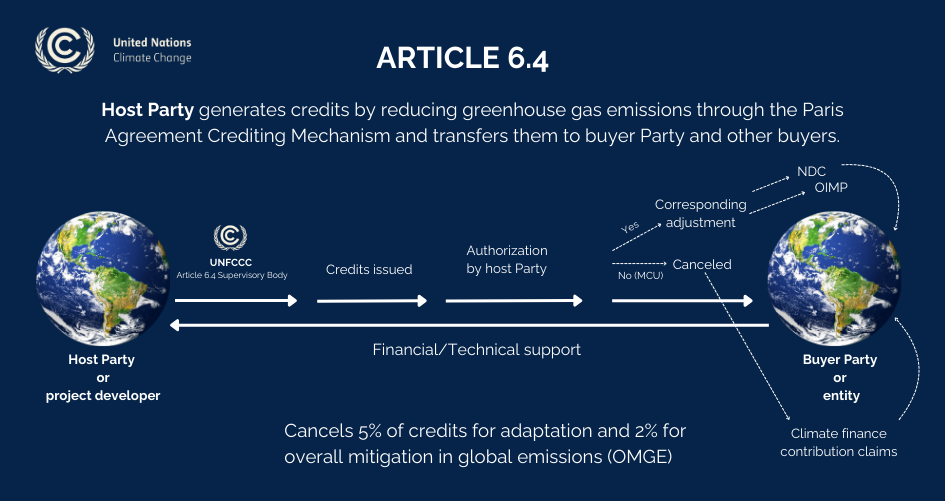

# 炭素クレジットとは？

*炭素市場と温室効果ガス削減の議論が始まる産業現場*

炭素クレジットは、温室効果ガスの削減・除去成果を移転・取引できるようにした単位です。一般に1クレジットは、二酸化炭素換算量1トン（1tCO₂e）を削減または大気から除去した成果を表します。

例えば、化石燃料発電を再生可能エネルギーへ置き換える、埋立地のメタンを回収する、劣化した森林を復元する事業を考えてみましょう。事業がなかった場合と比べて実際に削減された温室効果ガス量を計算し、第三者検証を経て登録簿から発行されると炭素クレジットになります。

核心は「良い環境事業を行った」という主張ではありません。**どれだけ追加的な削減が起こり、その結果をどの根拠で確認できるか**を共通単位で証明することです。

## 炭素クレジットはどこから始まったのか

炭素クレジットの源流は、1992年採択の国連気候変動枠組条約（UNFCCC）と1997年採択の京都議定書にあります。国際社会は気候変動へ共同で対応することに合意しましたが、削減に必要な費用と条件は国・地域で異なりました。

京都議定書は先進国に法的拘束力のある削減目標を課し、国際排出量取引、共同実施（JI）、クリーン開発メカニズム（CDM）という市場メカニズムを整備しました。削減が必要な場所へ資金を流し、その成果を共通単位で認めるためです。[UNFCCC京都議定書](https://unfccc.int/process-and-meetings/the-kyoto-protocol)

特にCDMは、先進国が途上国の削減事業に参加し、検証済み削減量に応じてCERというクレジットを得られるようにしました。1 CERはCO₂ 1トンに相当します。事業登録、承認方法論、追加性の立証、モニタリング、検証、発行という現在の基本構造が、この過程で国際的に定着しました。[UNFCCCクリーン開発メカニズム](https://unfccc.int/process-and-meetings/the-kyoto-protocol/mechanisms-under-the-kyoto-protocol/the-clean-development-mechanism)

つまり炭素クレジットは、最初から単なる環境認証ではありませんでした。国際的な削減協力と気候資金をつなぐため、**削減成果を測定し、検証可能な単位へ変える政策手段**として発展しました。

## パリ協定は何を変えたのか

2015年採択のパリ協定では、ほぼすべての国が自ら国別削減目標（NDC）を定め、実施する体制へ移行しました。一国で生じた削減成果を他国や企業が使う場合、どちらの実績として計上するかがより重要になりました。

パリ協定第6条は、国が自主的に協力して削減目標を達成する枠組みを示します。

- **第6.2条**：国家間で移転される削減実績の承認、会計、報告
- **第6.4条**：UNFCCCが監督する新しい国際炭素クレジットメカニズム
- **第6.8条**：クレジット取引を伴わない非市場アプローチ

特に重要なのが**二重計上の防止**です。同じ削減量をホスト国と購入国が同時に主張すると、世界全体の削減が実際より多く見えてしまいます。そのため、国際移転される削減実績では、ホスト国承認と相当調整などの会計手続きが重要です。[UNFCCCパリ協定第6条](https://unfccc.int/process-and-meetings/the-paris-agreement/article6)

第6.4条メカニズムは、こうした原則に基づき、方法論、登録、検証、発行、移転を管理する新たな国際基準を構築しています。[UNFCCCパリ協定クレジットメカニズム](https://unfccc.int/process-and-meetings/the-paris-agreement/article-64-mechanism)

*第6.4条でホスト国の削減成果が承認・発行・移転される構造。出典：[UN Climate Change, Paris Agreement Crediting Mechanism](https://unfccc.int/process-and-meetings/the-paris-agreement/article-64-mechanism)*

## 炭素クレジットはどうつくられるのか

埋立地メタンを回収・処理する事業を例にします。回収設備を設置しただけでクレジットが発行されるわけではありません。

まず事業がなければ大気へ放出されたメタン量をベースラインとして定めます。次に、既存慣行や法的義務を超える追加的削減か確認します。その後、承認方法論に従い、メタン回収量・濃度、設備稼働時間などの現場データを集め、実際の削減量を計算します。

ここで必要なのがMRVです。

- **モニタリング（Monitoring）**：ガス流量、濃度、稼働時間などの活動データを継続的に収集・管理
- **報告（Reporting）**：方法論、計算結果、根拠資料を整理
- **検証（Verification）**：独立機関が原データと計算過程の妥当性を確認

検証済み削減量は、炭素基準の登録簿審査を経てクレジットとして発行されます。移転は登録簿へ記録され、最終利用された単位は取消・償却されて再利用できません。

このプロセスにデジタル技術を適用したものが**DMRV**です。センサーやメーターの原データから計算式、証跡、変更履歴までをデジタル環境で接続し、検証可能なデータフローをつくります。企業の運用データとクレジット発行をつなぐ仕組みは[DMRVとは？](/insights/?article=what-is-dmrv)で説明します。

DMRVがクレジットを自動発行するわけではありません。発行可否は、基準・方法論、独立検証、登録簿審査によって決まります。DMRVはその判断に必要なデータの信頼性と追跡可能性を高める基盤です。

## なぜ今、炭素クレジットが重要なのか

第一に、パリ協定後、クレジットは国家削減目標と国際協力により密接につながっています。削減が実際に起きたことだけでなく、どの国が実績を使い、二重計上をどう防いだかまで説明する必要があります。

第二に、クレジットは削減事業へ資金をつなぐ気候金融手段です。初期投資が大きい、または従来の収益だけでは事業化が難しい再生可能エネルギー、メタン削減、森林保護、炭素除去事業は、クレジット収益から追加資金を得られます。ただし購入は企業・国家の直接削減を代替するのではなく、補完するものでなければなりません。

第三に、国際航空など分野別規制で適格クレジットの役割が拡大しています。ICAOのCORSIAは国際航空排出を対象とする世界規模の市場メカニズムです。航空会社はどのクレジットでも使えるわけではなく、承認プログラム、ビンテージ、事業範囲、ホスト国確認などの条件を満たす単位だけを利用できます。2024〜2026年の第1フェーズに適用できる単位も別途定められています。[ICAO CORSIA](https://www.icao.int/CORSIA) · [ICAO 2024〜2026適格排出単位](https://www.icao.int/sites/default/files/environmental-protection/CORSIA/TAB/2026/Programme-Eligibility-Summary-Table-Apr2026.pdf)

クレジットの重要性が高まるとは、単に取引量が増えるという意味ではありません。国家目標、産業規制、企業戦略につながるほど、**政策・規制に合った品質を証明すること**が重要になります。

## 信頼できる炭素クレジットは何が違うのか

すべてのクレジットが同じ品質と価値を持つわけではありません。表示された1トンという数字とともに、その条件を見る必要があります。

- 事業がなければ起こらなかった追加的削減か。
- ベースラインと計算方法論は妥当か。
- 原データと証拠資料を確認できるか。
- 独立機関が結果を検証したか。
- 森林など貯留型事業では効果が十分長く続くか。
- 排出が別の地域へ移る漏出はないか。
- 同じ成果が二重に発行・使用されていないか。
- 発行、移転、最終取消が登録簿に残るか。
- 規制利用なら必要な承認・適格条件を満たすか。

クレジットは目に見えない削減成果を単位に変えたものです。信頼は名称や認証マーク一つではなく、データ、方法論、検証、会計手続きがつながることで生まれます。

## 最終的に重要なのは削減量の根拠

炭素クレジットは、気候行動に必要な資金を実際の削減事業へつなぐ有効な手段です。一方、根拠の弱い削減を数字にすれば市場全体の信頼を損ないます。

SamtonはSamton-DMRVを通じ、原データ収集から削減量算定、証跡管理、検証報告までを一つのデータフローとして構成します。

信頼できる市場の出発点は、最終的なクレジット数だけでなく、**その数字がどこで、どの基準により、どのような検証を経てつくられたか説明できること**です。

主要プログラムの歴史と違いは[炭素クレジット基準機関の歴史と役割](/insights/?article=carbon-credit-standards)で、排出枠との違いと一部規制制度における利用上限は[排出枠と炭素クレジットの違い](/insights/?article=allowance-vs-carbon-credit)で説明します。
